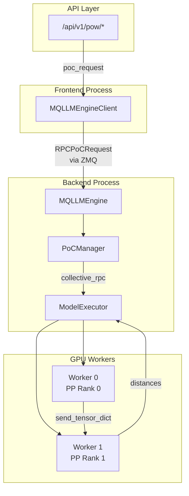

# Phase 4: Final Summary

## What Was Implemented

Phase 4 integrated the PoC (Proof of Compute) system into the vLLM API server with proper support for distributed execution (Tensor Parallel and Pipeline Parallel).

### Architecture Overview



### Key Components

| Component | File | Purpose |
|-----------|------|---------|
| Worker Operations | `vllm/poc/worker_ops.py` | GPU worker functions for collective_rpc, follows PP patterns |
| Manager | `vllm/poc/manager.py` | Orchestrates PoC rounds, uses model_executor |
| Routes | `vllm/poc/routes.py` | FastAPI endpoints |
| RPC Types | `vllm/engine/multiprocessing/__init__.py` | RPCPoCRequest/Response |
| Engine Handler | `vllm/engine/multiprocessing/engine.py` | Handles PoC requests in backend |
| Client Method | `vllm/engine/multiprocessing/client.py` | poc_request() with response routing |
| Protocol | `vllm/engine/protocol.py` | EngineClient interface |

### Performance

- **Generation Rate**: ~380-400 nonces/second (Qwen3-0.6B, seq_len=64)
- **Overhead**: Minimal - deterministic RNG on each worker avoids tensor serialization

### TP/PP Support

The implementation follows vLLM's established patterns for distributed execution:

1. **collective_rpc**: Executes worker operations on all GPUs
2. **Deterministic RNG**: Each worker generates identical inputs locally
3. **PP Coordination**: Same recv/send pattern as `Worker.execute_model()`
4. **TP Handling**: All workers process same input, model layers handle sharding

## Files Changed

### New Files (7)

```
vllm/poc/worker_ops.py       - Worker operations for collective_rpc
vllm/poc/routes.py           - FastAPI router
scripts/poc_callback_receiver.py - Test utility
tests/poc/test_routes.py     - API route tests
```

### Modified Files (10)

```
vllm/poc/manager.py          - Uses model_executor.collective_rpc()
vllm/poc/__init__.py         - Export poc_router
vllm/engine/multiprocessing/__init__.py - RPCPoCRequest/Response
vllm/engine/multiprocessing/engine.py   - _handle_poc_request()
vllm/engine/multiprocessing/client.py   - poc_request(), response routing
vllm/engine/protocol.py      - poc_request() in EngineClient
vllm/engine/async_llm_engine.py - poc_request() for V0
vllm/v1/engine/async_llm.py  - Stub poc_request() (NotImplementedError)
vllm/entrypoints/openai/cli_args.py - --enable-poc
vllm/entrypoints/openai/api_server.py - Include router, poc_enabled
scripts/poc_smoke_test.py    - Updated for new interface
tests/poc/test_manager.py    - Updated for new interface
```

## API Endpoints

| Endpoint | Method | Description |
|----------|--------|-------------|
| `/api/v1/pow/init` | POST | Initialize round |
| `/api/v1/pow/init/generate` | POST | Init + start generating |
| `/api/v1/pow/init/validate` | POST | Init + start validating |
| `/api/v1/pow/phase/generate` | POST | Switch to generate |
| `/api/v1/pow/phase/validate` | POST | Switch to validate |
| `/api/v1/pow/stop` | POST | Stop round |
| `/api/v1/pow/status` | GET | Get status |
| `/api/v1/pow/validate` | POST | Validate nonces |

## Test Results

```
pytest tests/poc/ -v
======================== 67 passed, 1 warning =========================

VLLM_USE_V1=0 python scripts/poc_smoke_test.py
  [PASS] Distances in valid range [0, 2]
  [PASS] Deterministic (recompute matches)
  [PASS] Different pubkey -> different distances
  [PASS] Stats tracking works
  [PASS] collective_rpc execution works
ALL CHECKS PASSED!

# E2E tests with real server
python scripts/poc_e2e_test.py --models qwen llama
  [PASS] Qwen/Qwen3-0.6B - Generation, Validation, Fraud Detection
  [PASS] unsloth/Llama-3.2-1B-Instruct - Generation, Validation, Fraud Detection
ALL TESTS PASSED!
```

## Key Fixes Applied

1. **Per-app callback state**: Replaced global `_callback_url` with per-app storage in `_poc_tasks` dict
2. **Removed dead code**: Removed unused `validate` action from engine.py (was using old tuple unpacking)
3. **Progress logging**: Added time-based logging (5s interval) with PoW-style format
4. **vLLM logger**: Use `init_logger(__name__)` for consistent log format
5. **r_target in responses**: Added to status and callback batches for debugging
6. **seq_len consistency**: Must match between generation and validation (default: 256)

## r_target Calibration

**UPDATE (Phase 4.2)**: With per-layer normalization and random lm_head (POC_OUTPUT_DIM=8192), the distribution is now **consistent across models and block_hashes**:

| Model | p10 (10% valid) | Cross-Block Spread |
|-------|-----------------|-------------------|
| Qwen/Qwen3-0.6B | ~1.404 | 3.5% |
| unsloth/Llama-3.2-1B-Instruct | ~1.407 | 2.0% |

**Recommended r_target**: ~1.405 for 10% valid rate (works for both models)

The previous model-specific calibration (Qwen ~1.145, Llama ~1.35) is **obsolete** - per-layer normalization breaks the trained model structure that caused those compressed distributions.

## Usage

```bash
# Start server
VLLM_USE_V1=0 python -m vllm.entrypoints.openai.api_server \
  --model Qwen/Qwen3-0.6B \
  --enable-poc \
  --port 8765

# Start generating
curl -X POST http://localhost:8765/api/v1/pow/init/generate \
  -H "Content-Type: application/json" \
  -d '{"block_hash":"abc","block_height":100,"public_key":"key","r_target":0.5,"node_id":0,"node_count":1}'

# Check status
curl http://localhost:8765/api/v1/pow/status
```

## Limitations

1. **V0 Engine Only**: V1 engine not yet supported (raises NotImplementedError)
2. **Single Server**: Multi-node distributed not yet tested
3. **No Inference Blocking**: Inference during PoC not blocked (deferred to Phase 6)

## Next Steps (Phase 5+)

1. **V1 Engine Support**: Implement poc_request in V1 async engine
2. **Inference Blocking**: Return 503 during PoC operations
3. **Callback Integration**: Test with actual PoC aggregator
4. **Multi-Node**: Test with distributed training setup

