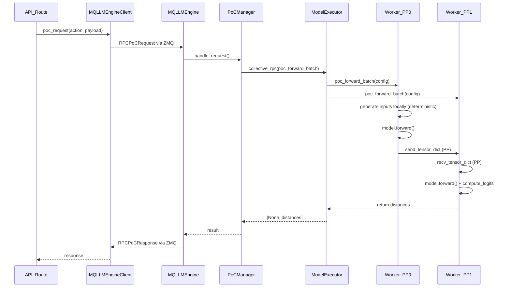

# Phase 4: API Integration

## Objective

Add PoC API routes to vLLM server with minimal changes to core code, supporting Tensor Parallel (TP) and Pipeline Parallel (PP) model configurations.

## Deliverable

Working API endpoints that can start/stop PoC and return results, with proper distributed execution via `collective_rpc`.

## Architecture

### Execution Flow (Multiprocessing Mode)



### Key Design Decisions

1. **TP/PP Support via collective_rpc**: Instead of direct model access, PoCManager uses `model_executor.collective_rpc()` to execute PoC batches on all workers
2. **Deterministic RNG on Workers**: Each worker generates identical inputs locally using deterministic GPU RNG, avoiding tensor serialization overhead
3. **PP Coordination**: Worker operations follow the same patterns as `Worker.execute_model()` - recv from previous rank, forward, send to next rank
4. **Isolated Module**: All PoC code stays in `vllm/poc/`, minimal changes to vLLM core

## API Endpoints

| Endpoint | Method | Description |
|----------|--------|-------------|
| `/api/v1/pow/init` | POST | Initialize PoC round |
| `/api/v1/pow/init/generate` | POST | Init + start generating |
| `/api/v1/pow/init/validate` | POST | Init + start validating |
| `/api/v1/pow/phase/generate` | POST | Switch to generate mode |
| `/api/v1/pow/phase/validate` | POST | Switch to validate mode |
| `/api/v1/pow/validate` | POST | Validate submitted nonces (accepts ProofBatch) |
| `/api/v1/pow/status` | GET | Get status and valid nonces |
| `/api/v1/pow/stop` | POST | Stop current round |

## Implementation

### New Files

#### `vllm/poc/worker_ops.py`

Worker operations for collective_rpc - follows `Worker.execute_model()` patterns:

```python
@torch.inference_mode()
def poc_forward_batch(
    worker,  # Injected by collective_rpc
    block_hash: str,
    public_key: str,
    nonces: List[int],
    seq_len: int,
    vocab_size: int,
    hidden_size: int,
    r_target: float,
    vllm_config,
) -> Optional[Dict[str, Any]]:
    """Execute PoC forward pass following Worker.execute_model() patterns."""
    device = worker.device
    dtype = worker.model_runner.model_config.dtype
    model = worker.model_runner.model
    
    # Generate inputs locally (deterministic - all workers get same)
    inputs_embeds = generate_inputs(block_hash, public_key, nonces, ...)
    
    # === PP Pattern from Worker.execute_model() ===
    intermediate_tensors = None
    if not get_pp_group().is_first_rank:
        intermediate_tensors = IntermediateTensors(
            get_pp_group().recv_tensor_dict(all_gather_group=get_tp_group())
        )
    
    # Forward pass
    with set_forward_context(attn_metadata, vllm_config):
        hidden_states = model(
            input_ids=None,
            positions=positions.flatten(),
            intermediate_tensors=intermediate_tensors,
            inputs_embeds=inputs_embeds.view(-1, hidden_size),
        )
    
    # PP: send to next rank or compute final
    if not get_pp_group().is_last_rank:
        if isinstance(hidden_states, IntermediateTensors):
            get_pp_group().send_tensor_dict(...)
        return None
    
    # Last PP rank: compute logits and distances
    logits = _compute_logits(model, last_hidden)
    distances = compute_distances(logits.float(), permutations, target)
    
    return {"nonces": nonces, "distances": distances.cpu().tolist()}
```

#### `vllm/poc/routes.py`

FastAPI router with all PoC endpoints.

### Modified Files

#### `vllm/poc/manager.py`

Updated to use `model_executor.collective_rpc()`:

```python
class PoCManager:
    def __init__(self, model_executor, model_config, vllm_config):
        self.model_executor = model_executor  # Use executor, not model directly
        # ...
    
    def run_batch(self) -> ProofBatch:
        from .worker_ops import poc_forward_batch
        
        nonces = self.get_next_nonces()
        
        # Execute via model_executor - handles TP/PP
        results = self.model_executor.collective_rpc(
            poc_forward_batch,
            args=(self.config.block_hash, self.config.public_key, nonces, ...),
        )
        
        # Find result from last PP rank (non-None)
        result = next(r for r in results if r is not None)
        return ProofBatch(...)
```

#### `vllm/engine/multiprocessing/__init__.py`

Added RPC types:

```python
@dataclass
class RPCPoCRequest:
    action: str  # "init", "start_generate", "start_validate", "stop", "status", "validate"
    payload: dict
    request_id: str = field(default_factory=lambda: str(uuid.uuid4()))

@dataclass
class RPCPoCResponse:
    request_id: str
    success: bool
    result: dict
```

#### `vllm/engine/multiprocessing/engine.py`

Added handler for `RPCPoCRequest` -> creates/uses PoCManager.

#### `vllm/engine/multiprocessing/client.py`

Added `poc_request()` method and response routing for `RPCPoCResponse`.

#### `vllm/engine/protocol.py`

Added `poc_request()` to EngineClient protocol.

#### `vllm/engine/async_llm_engine.py`

Implemented `poc_request()` for V0 engine (in-process mode).

#### `vllm/v1/engine/async_llm.py`

Added stub `poc_request()` that raises NotImplementedError (V1 not supported yet).

#### `vllm/entrypoints/openai/cli_args.py`

Added `--enable-poc` flag.

#### `vllm/entrypoints/openai/api_server.py`

Include PoC router when enabled, set `state.poc_enabled`.

## Directory Structure After Phase 4

```
vllm/
├── poc/
│   ├── __init__.py
│   ├── config.py
│   ├── data.py
│   ├── gpu_random.py
│   ├── manager.py      # Uses collective_rpc
│   ├── worker_ops.py   # Worker operations for TP/PP
│   ├── routes.py       # FastAPI router (includes callback logic)
│   └── layer_hooks.py  # Layer transformations
├── engine/
│   ├── multiprocessing/
│   │   ├── __init__.py  # RPCPoCRequest/Response
│   │   ├── engine.py    # Handle RPCPoCRequest
│   │   └── client.py    # poc_request() method
│   ├── protocol.py      # EngineClient.poc_request()
│   └── async_llm_engine.py  # poc_request() for V0
└── entrypoints/openai/
    ├── api_server.py    # Include poc_router
    └── cli_args.py      # --enable-poc

scripts/
├── poc_smoke_test.py    # Smoke test with real model
└── poc_callback_receiver.py  # Test callback receiver

tests/poc/
├── test_data.py
├── test_gpu_random.py
├── test_manager.py      # Updated for new interface
└── test_routes.py       # NEW - API route tests
```

## Usage

```bash
# Start server with PoC enabled (V0 engine required)
VLLM_USE_V1=0 python -m vllm.entrypoints.openai.api_server \
  --model Qwen/Qwen3-0.6B \
  --enable-poc \
  --port 8765

# Initialize and start generating
curl -X POST http://localhost:8765/api/v1/pow/init/generate \
  -H "Content-Type: application/json" \
  -d '{
    "block_hash": "abc123",
    "block_height": 100,
    "public_key": "node1",
    "r_target": 0.5,
    "node_id": 0,
    "node_count": 1
  }'

# Check status
curl http://localhost:8765/api/v1/pow/status

# Switch to validate mode
curl -X POST http://localhost:8765/api/v1/pow/phase/validate

# Validate nonces
curl -X POST http://localhost:8765/api/v1/pow/validate \
  -H "Content-Type: application/json" \
  -d '{
    "public_key": "node1",
    "block_hash": "abc123",
    "block_height": 100,
    "nonces": [0, 1, 2],
    "dist": [0.3, 0.4, 0.5],
    "node_id": 0
  }'

# Stop round
curl -X POST http://localhost:8765/api/v1/pow/stop
```

## Running Tests

```bash
# Unit tests
pytest tests/poc/ -v

# Smoke test with real model
VLLM_USE_V1=0 python scripts/poc_smoke_test.py
```

## Acceptance Criteria

- [x] All 8 endpoints working
- [x] `--enable-poc` flag controls endpoint availability
- [x] Works with multiprocessing mode (no `--disable-frontend-multiprocessing`)
- [x] TP/PP support via collective_rpc
- [x] Deterministic RNG on workers (no tensor serialization overhead)
- [x] Can init, generate, validate, and stop rounds
- [x] Validation recomputes distances correctly
- [x] All unit tests pass: `pytest tests/poc/ -v` (67 tests)
- [x] Smoke test passes: `VLLM_USE_V1=0 python scripts/poc_smoke_test.py`
- [x] E2E test passes: `python scripts/poc_e2e_test.py --models qwen llama`

## E2E Test Script

`scripts/poc_e2e_test.py` provides full integration testing:

1. **Generation Phase**: Start server, generate nonces, collect valid ones
2. **Restart Validation**: Restart server, validate same nonces produce same distances
3. **Fraud Detection**: Verify wrong block_hash/public_key triggers fraud detection

```bash
python scripts/poc_e2e_test.py --models qwen llama
```

## Important Notes

### seq_len Consistency
The `seq_len` parameter must match between generation and validation. Default is 256 (in `PoCConfig`). Mismatched seq_len causes completely different distances.

### r_target Calibration  
The theoretical R formula (`estimate_R_from_experiment`) assumes random unit vectors. Model outputs have structure, so r_target must be empirically calibrated per model.
