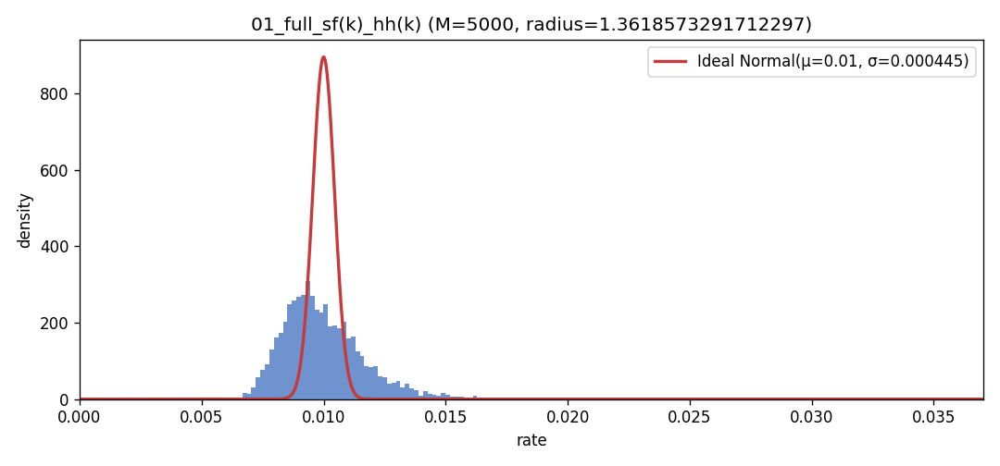
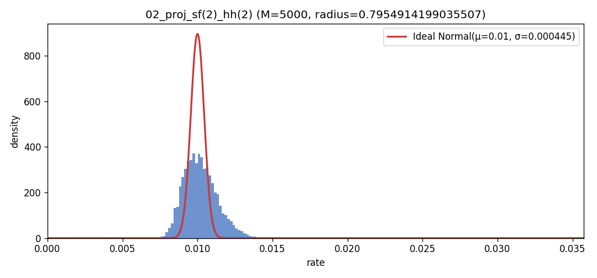
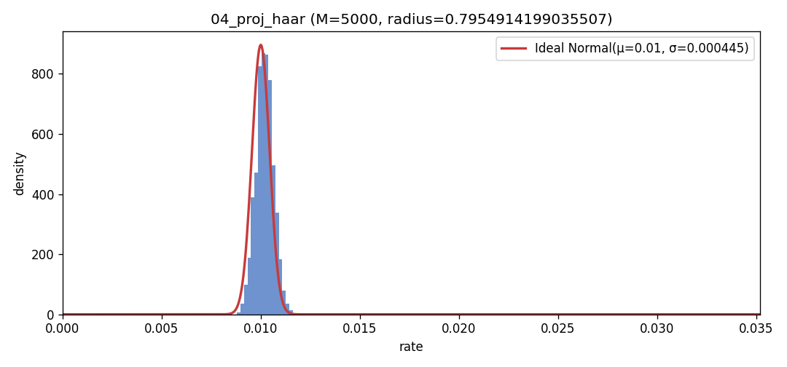

# PoC distribution experiment (Qwen, 50k vectors): bubble-test histograms + summaries

## Context: what problem is being solved?

In PoC (Proof of Computation), we derive **high-dimensional vectors** from model computation (here: last-token hidden states) and want a **deterministic, validator-reproducible** way to map them to something that behaves “close to uniform on the unit sphere”.  

Why: raw hidden-state directions can be structured (bias / anisotropy). If a verifier expects “random-looking” directions from a nonce-seeded transform, we need transforms that reduce that structure **without randomness beyond deterministic seeds**.

This experiment compares several deterministic regimes (projection + mixing transforms) using the **bubble test** and summarizes the resulting distributions.

## Where this report came from

This report is a self-contained copy of artifacts originally produced under:

- `vllm/scripts/poc_distribution/data/exp_50k_raw_qwen/qwen/analysis_bubble_p001_m5000_bins200_radmax100M/`

## What data is used?

- **Collector**: `vllm/scripts/poc_distribution/collect_hidden_vectors.py`
  - Starts a local vLLM OpenAI server with PoC enabled (`--enable-poc`)
  - Initializes PoC (`/api/v1/pow/init`) and enters `GENERATING`
  - Repeatedly calls `/api/v1/pow/batch`
  - Extracts and saves `artifacts.last_hidden_unit_pre` (full dimension) + `nonces`
  - Output: `hidden_unit_vectors.npy` (float16) + `meta.json` under `.../raw/`

- **Analyzer**: `vllm/scripts/poc_distribution/run_bubble_from_raw.py`
  - Loads vectors from the raw folder, **unit-normalizes**
  - Applies deterministic transforms seeded by `block_hash` + `public_key` (+ per-sample `nonce`)
  - Runs the bubble test and writes:
    - `summary.json`
    - `bubble_rate_hist.png`
    - `bubble_rates.npy`
    - optional `data.npz` (stores `x`, rates, etc.)

## Bubble test: what the histogram means

For each run, we sample **M random target directions** \(t \in S^{d-1}\). For each target, we compute the **bubble rate**:

- \( \text{rate}(t) = \frac{1}{N}\sum_{i=1}^{N} \mathbf{1}\{\|x_i - t\|\le r\} \)

where:
- \(x_i\) are the (transformed) unit vectors
- \(r\) is the bubble radius

If the transformed dataset behaves like uniform random directions, the rates should concentrate around the **target rate** (here \(p = 0.01\)) with a relatively tight spread.

## This run: parameters at a glance

- **Dataset size**: `N = 50000`
- **Bubble targets**: `M = 5000`
- **Target rate**: `p = 0.01`
- **Histogram bins**: `200`
- **Projected regimes share a radius**: see `shared_radius_projected.json`

## Setups (source of truth: `run_bubble_from_raw.py --preset exp50k_qwen4`)

All regimes start from unit vectors derived from raw `last_hidden_unit_pre`. Seeds come from `block_hash`, `public_key`, and `nonce` (per sample).

- **01_full_sf(k)_hh(k)** (`d_analyze = d_full = 1024`)
  - No projection (full dimension)
  - Apply sign flips for `k` rounds
  - Apply Householder reflections for `k` reflections
  - **Radius is chosen on this transformed full-d dataset** (not shared with projected runs)

- **02_proj_sf(2)_hh(2)** (`d_analyze = k = 10`)
  - Fixed full→k projection (deterministic, seeded by `block_hash+public_key`)
  - Apply sign flips for 2 rounds
  - Apply Householder reflections for 2 reflections
  - Uses the **shared projected radius**

- **03_proj_sf(k)_hh(k)** (`d_analyze = k = 10`)
  - Fixed full→k projection (same base as setup 02/04)
  - Apply sign flips for `k` rounds
  - Apply Householder reflections for `k` reflections
  - Uses the **shared projected radius**

- **04_proj_haar** (`d_analyze = k = 10`)
  - Fixed full→k projection (same base as setup 02/03)
  - Apply a per-nonce Haar rotation in k (no sign flips / no Householder here)
  - Uses the **shared projected radius**

## Key summary statistics (bubble rates)

Numbers below are copied from each setup’s `summary.json` (bubble rates are across `M=5000` random targets).

| Setup | d_analyze | bubble_radius | rate_mean | rate_std | rate_min | rate_max |
|---|---:|---:|---:|---:|---:|---:|
| 01_full_sf(k)_hh(k) | 1024 | 1.361857 | 0.0099940 | 0.0016829 | 0.0064000 | 0.0208000 |
| 02_proj_sf(2)_hh(2) | 10 | 0.795491 | 0.0102045 | 0.0011090 | 0.0074200 | 0.0157400 |
| 03_proj_sf(k)_hh(k) | 10 | 0.795491 | 0.0101926 | 0.0004593 | 0.0085800 | 0.0117600 |
| 04_proj_haar | 10 | 0.795491 | 0.0102042 | 0.0004433 | 0.0088200 | 0.0117000 |

## Histograms (2×2 grid)

| 01_full_sf(k)_hh(k) | 02_proj_sf(2)_hh(2) |
|---|---|
|  |  |
| 03_proj_sf(k)_hh(k) | 04_proj_haar |
|  |  |
